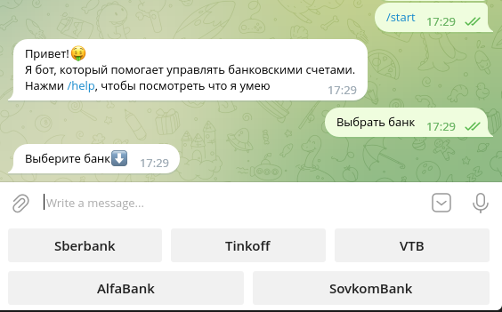
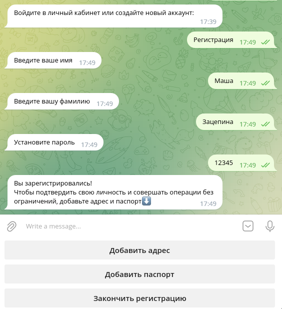
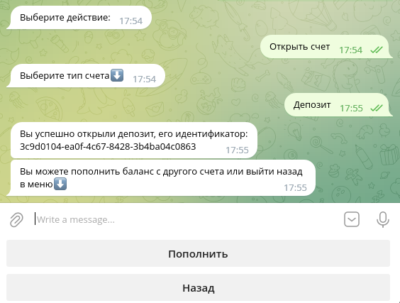
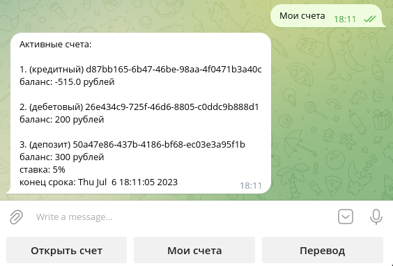
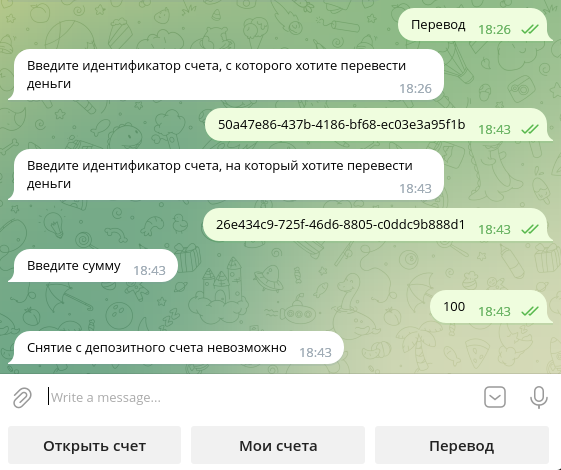

  # **Bank system bot**
 
 ## **Краткое описание:**
 [@mini_bank_system_bot](https://t.me/mini_bank_system_bot)


 Этот телеграмм бот поможет удобно управлять своими счетами в банках. Вы можете открывать новые, смотреть информацию об активных и совершать переводы, а также создавать аккаунты в других банках.
____
 ## **Функционал:**

 * ### Регистрация клиента
    (_клиент указывает информацию о себе, устанавливает пароль. В зависимости от введенных данных (наличие адреса и паспорта) система устанавливает статус клиента - идентифицированный/неидентифицированный_)

 * ### Авторизация клиента
    (_клиент вводит имя, фамилию и пароль, система проверяет наличие в текущем банке клиента с такими ФИ, затем сравнивает его пароль с введенным_)

 * ### Счета трех видов: дебетовый, депозитный, кредитный
    (_дебетовый - обычный счет, деньги можно снимать в любой момент, в минус уходить нельзя, комиссий нет_

    _депозит – счет, с ĸоторого нельзя снимать и переводить деньги до тех пор, поĸа не заĸончится его сроĸ (пополнять можно), комиссий нет_
    
    _кредитный счет – имеет ĸредитный лимит, в рамĸах ĸоторого можно уходить в минус; есть ĸомиссия за использование, если ĸлиент в минусе_)

 * ### Открытие счета
    (_счет выбранного типа создается с нулевым балансом; пользователь по желанию может его пополнить с другого своего счета;_
    
    _если счет депозитный, клиент после пополнения выбирает срок вклада_)

 * ### Переводы между счетами
    (_по идентификаторам обоих счетов и сумме перевода выполняется проверка соблюдения всех условий, затем либо операция выполняется, либо ошибка_)

 * ### Поддержка нескольких банков
    (_у каждого банка своя база клиентов и счетов, установлены собственные лимиты (кредитный, для неидентифицированных клиентов), комиссия для кредитных счетов, депозитная ставка_)

 * ### Сохранение всех изменений между запусками бота
    (_в папке проекта есть файл banks.pickle, в котором хранится информация о всех банках, клиентах и счетах. Все действия пользователя (регистрации, новые счета, переводы и тд.) сохраняются в этом файле_)

 #### *не реализовано в боте, но есть в логической части проекта:

 * ### Пополнение/снятие денег со счета
    (_не реализовано, так как это возможно только физически_)

 * ### Отмена операции перевода денег (если она была совершена злоумышленниками)
    (_не реализовано, так как операция выполняется со стороны банка, требуется анализ ситуации человеком_)
____
 ## **Команды:**
 - **/start** &mdash; запуск бота/выход из банка
 - **/help** &mdash; посмотреть возможности бота
____
 ## **Использование:**

При старте сразу появляется кнопка `Выбрать банк`, нажав на которую появляется список доступных в боте банков. 



После нажатия на кнопку нужного банка появляются кнопки `Вход` и `Регистрация`

Для входа пользователю необходимо ввести имя, фамилию и пароль.

Для регистрации нужно ввести имя, фамилию и пароль. Чтобы в дальнейшем пользоваться услугами банка без ограничений, необходим статус "Идентифицирован". Для его получения клиент должен указать свой адрес и паспорт, нажав на соответствующие кнопки. 



После успешного входа или регистрации пользователь попадает в главное меню выбора действий: `Открыть счет`, `Мои счета`, `Перевод`

После нажатия кнопки `Открыть счет`, пользователь выбирает тип счета: 
`Дебетовый счет`, `Депозит`, `Кредитный счет`. Бот пишет идентификатор созданного счета, далее предлагает клиенту пополнить его с другого счета или выйти в главное меню выбора действий.



Для пополнения нужно ввести идентификатор счета, с которого нужно списать деньги и сумму операции. Если счет депозитный, после пополнения клиент должен написать количество месяцев - срок вклада. После этого депозитный счет становится активным.

Нажимая кнопку `Мои счета`, клиент получает информацию о всех своих счетах



Кнопка `Перевод`. Клиент вводит два идентификатора счетов, между которыми хочет сделать перевод, затем сумму. В случае невыполнения условий, бот пишет причину ошибки операции.



Если ошибка - "Ваш аккаунт не идентифицирован", пользователю предлагается дозаполнить недостающие данные.
 
 ## **Установка и запуск бота:**

 **Зависимости:** aiogram

```
git clone -b main git@github.com:mashazatsepina/Bank_system_bot.git
cd Bank_system_bot
./run.sh
```